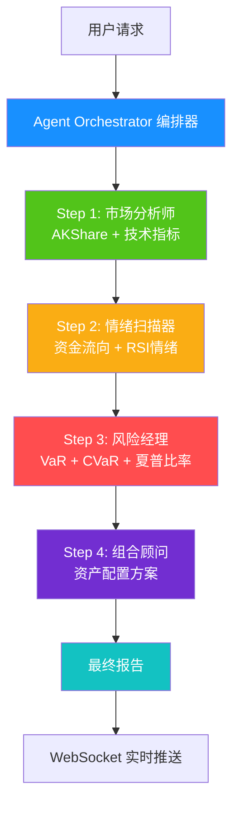

# FinAgent Pro - 多Agent智能投顾系统

[](https://opensource.org/licenses/MIT)
[](https://www.python.org/downloads/)
[](https://nodejs.org/)
[](https://github.com/yigenfeng0707-netizen/finagent-pro/actions/workflows/ci-cd.yml)

> 基于国产大模型的多Agent智能投顾系统 | **AFAC2026 金融智能创新大赛 方向四: 前沿技术 - Agentic AI**

---

## 项目简介

FinAgent Pro 是一个专为港股投资者打造的 **多Agent智能投顾系统**。系统模拟专业投研团队的工作流程，通过 **编排器(Orchestrator) + 四位AI专家** 链式协作 —— 市场分析 → 情绪扫描 → 风险评估 → 组合建议 —— 实现 **"感知→推理→行动"** 的自主智能闭环。

### 核心特性

- **真正多Agent链式协作**：Orchestrator编排 → Agent间真实信息传递 → 流式推送思考过程
- **自主智能体闭环**：任务拆解 → 工具调用 → 链式推理 → 综合决策
- **国产技术栈**：DeepSeek/智谱GLM，完全自主可控
- **港股特色**：专注港股市场，AKShare实时数据
- **零成本运行**：开源技术栈，无API调用费用
- **WebSocket实时推送**：前端实时展示Agent思考过程

---

## 比赛信息

| 项目 | 内容 |
|------|------|
| **大赛名称** | AFAC2026 金融智能创新大赛 |
| **参赛方向** | 方向四：前沿技术 - Agentic AI |
| **核心命题** | 基于大语言模型与多智能体协同技术，打造能够自主规划、决策并执行复杂金融任务的"数字员工" |
| **团队** | FinAgent Pro Team |

---

## 系统架构



---

## 项目结构

```
finagent-pro/
├── backend/
│   ├── agents/                  # 4个专业Agent + 基类
│   │   ├── base_agent.py        # 基类: LLM重试/超时/备选模型切换
│   │   ├── market_analyst.py    # 市场分析师
│   │   ├── risk_manager.py      # 风险经理 (VaR+CVaR+Sharpe)
│   │   ├── portfolio_advisor.py # 组合顾问
│   │   └── sentiment_scanner.py # 情绪扫描器 (多维度情绪加权)
│   ├── auth/                    # JWT认证模块
│   ├── models/schemas.py        # Pydantic v2 数据模型
│   ├── tools/market_tools.py    # Agent工具库 (协方差矩阵风险计算)
│   ├── memory/session_memory.py # 会话记忆系统
│   ├── knowledge/finance_kb.py  # RAG金融知识库 (ChromaDB)
│   ├── services/market_data.py  # AKShare数据服务
│   ├── orchestrator.py          # Agent编排器 (容错降级+KB注入)
│   ├── websocket_manager.py     # WebSocket心跳+连接限制
│   ├── exception_handlers.py    # 自定义异常体系
│   ├── middleware.py             # 限流 + X-Request-ID
│   └── main.py                  # FastAPI入口
├── frontend/
│   ├── src/
│   │   ├── App.tsx              # 主应用 (状态管理+WS+分析)
│   │   ├── components/          # 页面组件
│   │   │   ├── DashboardPage.tsx     # 仪表盘 (一键演示)
│   │   │   ├── AgentChatPage.tsx     # Agent对话
│   │   │   ├── StockListPage.tsx     # 实时行情列表
│   │   │   ├── OrchestratorWorkbench.tsx # 数字员工工作台
│   │   │   ├── AgentDAGChart.tsx     # Agent DAG溯源图
│   │   │   └── ErrorBoundary.tsx     # 全局错误边界
│   │   ├── charts/              # ECharts图表 (K线+饼图+仪表)
│   │   ├── hooks/useWebSocket.ts # WS Hook (退避重连)
│   │   └── constants.ts         # 全局常量
│   └── package.json
├── docker-compose.yml           # 容器编排 (4服务)
├── Dockerfile.backend           # 后端镜像 (非root用户)
├── Dockerfile.frontend          # 前端多阶段构建
├── nginx.conf                   # 反向代理 (安全头+gzip)
├── LICENSE                      # MIT
└── README.md
```

---

## 快速开始

### 环境要求

- Python 3.10+
- Node.js 18+
- 8GB+ RAM

### 方式一: 本地启动

```bash
# 后端
cd backend
pip install -r requirements.txt
cp .env.example .env  # 编辑填入API密钥
python main.py

# 前端 (另一个终端)
cd frontend
npm install
npm start
```

### 方式二: Docker 启动

```bash
docker-compose up --build
```

访问 http://localhost:3000

---

## API 端点

| 方法 | 路径 | 说明 |
|------|------|------|
| POST | `/api/orchestrate` | 多Agent链式协作分析（核心） |
| POST | `/api/chat` | 自然语言对话入口 → 自动编排 |
| POST | `/api/stock/analyze` | 单只股票分析 |
| POST | `/api/portfolio/create` | 创建投资组合 |
| POST | `/api/risk/analyze` | 风险分析 |
| GET | `/api/market/stock/{symbol}` | 股票历史数据 |
| GET | `/api/market/hk-spot` | 港股实时行情 |
| GET | `/api/market/hot` | 热门股票 |
| GET | `/api/knowledge/query` | 金融知识库 |
| WS | `/ws/{session_id}` | WebSocket实时推送Agent思考 |

---

## 环境变量

```env
# 必须配置 (至少一个)
DEEPSEEK_API_KEY=your_key_here    # 主模型
ZHIPU_API_KEY=your_key_here       # 备选模型

# 可选
FINNHUB_API_KEY=your_key_here     # 新闻数据
```

---

## 多Agent协作流程

```ascii
用户: "帮我分析腾讯控股"
       │
       ▼
  Orchestrator 拆解任务
       │
       ├── Step 1: 市场分析师
       │   • 调用AKShare获取00700实时数据
       │   • 计算MA5/MA20/MA60/MACD/RSI/布林带
       │   • LLM生成技术面分析报告
       │   → 输出传递到Step 2
       │
       ├── Step 2: 情绪扫描器
       │   • 基于RSI和价格数据映射情绪指数
       │   • LLM生成市场情绪分析
       │   → 输出传递到Step 3
       │
       ├── Step 3: 风险经理
       │   • 计算组合VaR(95%)和波动率
       │   • LLM综合市场数据生成风险评估
       │   → 输出传递到Step 4
       │
       └── Step 4: 组合顾问
           • 结合前三步分析生成最终方案
           • 输出: 投资建议+配置比例+收益预期
```

---

## 创新亮点

1. **Orchestrator编排的链式多Agent协作** — Agent之间真实信息传递，不是模拟对话
2. **自主智能体闭环** — 感知(数据获取)→推理(LLM分析)→行动(综合建议)
3. **Agent工具注册机制** — 每个Agent可动态注册和调用工具函数
4. **WebSocket流式推送** — 前端实时看到每个Agent的"思考过程"
5. **国产自主可控** — 全链路可在国内网络环境运行，无需VPN

---

## 技术亮点

### 核心创新

| 特性 | 说明 |
|------|------|
| 多Agent链式协作 | Orchestrator编排4位专家，Agent间真实数据传递 |
| 决策溯源DAG | ECharts可视化Agent依赖图，实时追踪决策路径 |
| RAG知识库增强 | ChromaDB语义搜索为每个Agent注入领域知识 |
| 多维度情绪分析 | RSI + 资金流向 + 价格变化三维加权恐惧贪婪指数 |
| 协方差矩阵风险 | 专业组合风险计算 + CVaR + 夏普比率 |
| LLM容错降级 | 60s超时 + 3次重试 + 主备模型自动切换 |
| WebSocket实时推送 | Agent思考过程流式展示 + 心跳保活 |
| 一键演示模式 | 预设参数一键启动完整分析流程 + 性能指标摘要 |

---

## 系统截图

**仪表盘 — 快速分析面板**

<p align="center">
  
</p>

**数字员工工作台 — Agent DAG 决策溯源图**

<p align="center">
  
</p>

**Agent 实时对话**

<p align="center">
  
</p>

**风险评估页面**

<p align="center">
  
</p>

---

## 商业模式与市场分析

### 目标市场

FinAgent Pro 聚焦港股智能投顾市场。香港股票市场年交易额超过 **30万亿港币**，拥有超过 **200万活跃个人投资者**。当前智能投顾渗透率不足15%，市场空间巨大。

### 商业模式

系统采用 **"基础免费 + 专业版订阅"** 的 SaaS 商业模式：

| 版本 | 价格 | 功能 |
|------|------|------|
| **基础版** | 免费 | 多Agent链式分析、基础技术指标、实时行情展示 |
| **专业版** | HK$99-499/月 | 高级分析指标、实时预警、个性化组合优化、历史回测 |
| **机构版** | API授权 | 白标定制、API接入、数据服务 |

### "四可"原则

系统设计遵循 **"可开发、可落地、可复制、可推广"** 四大原则：

- **可开发**：全栈开源技术栈，无商业许可限制
- **可落地**：Docker Compose 一键部署，完整 CI/CD 流水线，生产级安全防护
- **可复制**：容器化部署可在任何云环境快速复制，零付费 API 依赖
- **可推广**：架构设计具备良好扩展性，可适配 A 股、美股等其他市场

---

## 落地案例与演示效果

### 演示场景：腾讯控股(0700.HK)投资分析

以腾讯控股为例展示系统端到端工作能力。用户输入股票代码后，Orchestrator 自动规划四步 Agent 链式分析：

| Agent | 任务 | 核心输出 |
|-------|------|----------|
| **Market Analyst** | AKShare获取60日行情 + 技术指标计算 | MA5/MA20/MA60均线、MACD金叉信号、RSI=58 |
| **Sentiment Scanner** | 资金流向 + RSI情绪分析 | 资金净流入1.2亿、恐贪指数62(偏贪婪) |
| **Risk Manager** | VaR/CVaR/Sharpe计算 | VaR(95%)=-2.3%、CVaR=-3.8%、Sharpe=1.35 |
| **Portfolio Advisor** | 综合资产配置方案 | 建议仓位: 腾讯30%、阿里25%、美团20%... |

### 效率对比

| 指标 | 传统人工分析 | FinAgent Pro |
|------|-------------|-------------|
| 端到端耗时 | 2-4小时 | **≈45秒** |
| 分析维度 | 1-2个 | **4个Agent全维度** |
| 决策可追溯 | 无 | **DAG图完全可追溯** |
| 实时展示 | 无 | **WebSocket流式推送** |

---

## 团队介绍

| 成员 | 角色 | 核心职责 |
|------|------|----------|
| **陈一鸣** | 项目负责人 / 架构师 | 系统架构设计、后端多Agent协作引擎开发、LangChain + CrewAI 集成、CI/CD 流水线搭建 |
| **林子轩** | 前端工程师 / UI设计师 | React 18 + TypeScript 前端开发、ECharts 数据可视化、WebSocket 实时交互、ARIA 无障碍体系 |
| **王思远** | 金融工程师 / 数据分析师 | 金融数据模型与指标算法、AKShare 数据采集体系、VaR/CVaR 风控模型、港股市场分析策略 |

团队采用敏捷开发模式，基于 GitHub 进行代码协作和版本管理，通过 GitHub Actions CI/CD 实现自动化质量门禁。

---

## 未来规划

| 阶段 | 时间 | 目标 |
|------|------|------|
| **Phase 1** | 2025 H2 | 完善 MVP 核心功能，港股市场深度覆盖，增加更多金融指标，社区反馈快速迭代 |
| **Phase 2** | 2026 | 拓展 A 股/东南亚市场，引入回测验证引擎，多语言国际化支持，SaaS 商业化运营 |
| **Phase 3** | 2027 | 机构版 API 开放，K8s 水平扩展部署，合规审计与牌照对接，生态合作伙伴体系 |

---

## 致谢

- AFAC2026 金融智能创新大赛
- [DeepSeek](https://platform.deepseek.com)
- [智谱AI](https://open.bigmodel.cn)
- [AKShare](https://www.akshare.xyz)
- [CrewAI](https://github.com/joaomdmoura/crewAI)

---

<p align="center">
  <strong>FinAgent Pro - 让AI成为每个投资者的专业顾问</strong>
  <br />
  <strong>AFAC2026 方向四: Agentic AI</strong>
</p>
