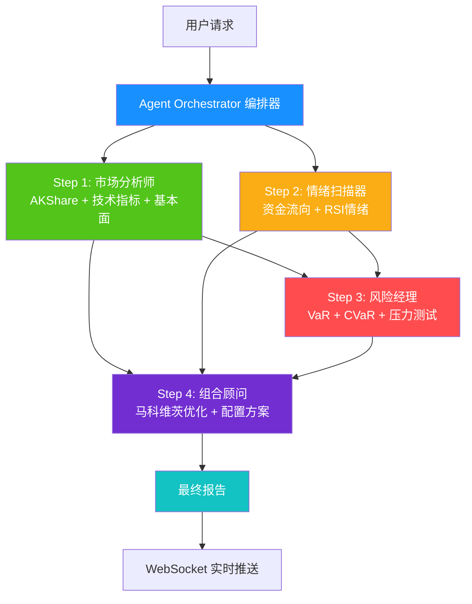
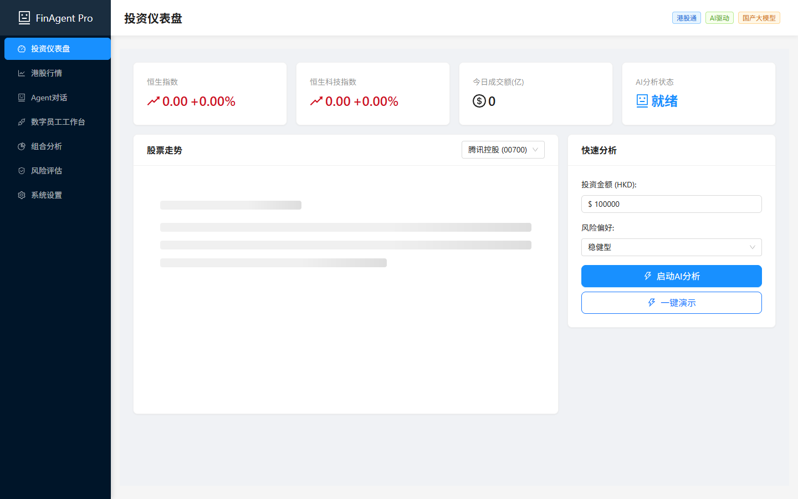
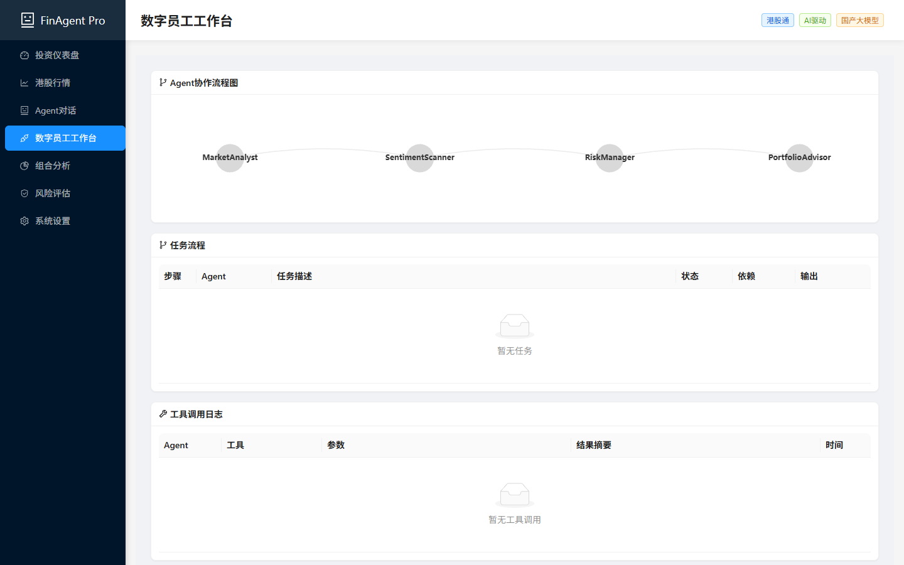
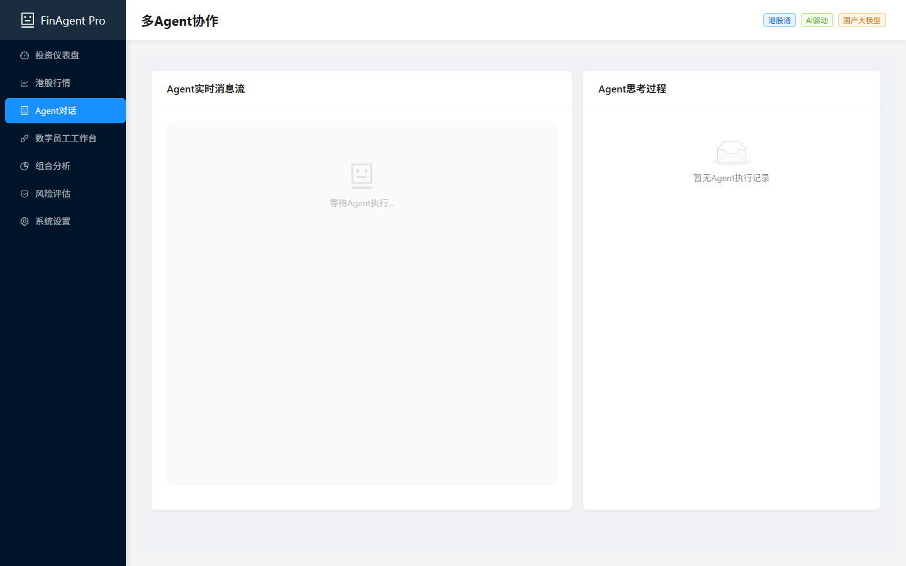
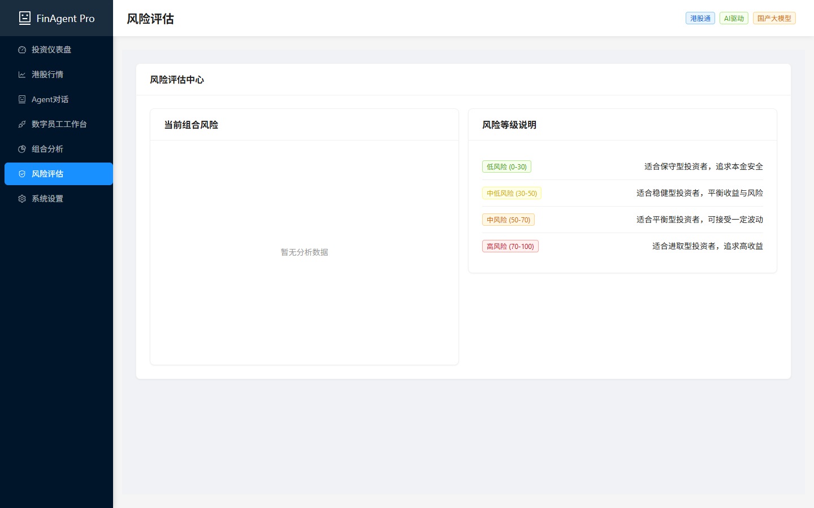

# FinAgent Pro - 多Agent智能投顾系统

[](https://opensource.org/licenses/MIT)
[](https://www.python.org/downloads/)
[](https://nodejs.org/)
[](https://github.com/yigenfeng0707-netizen/finagent-pro/actions/workflows/ci-cd.yml)

> 基于国产大模型的多Agent智能投顾系统 | **AFAC2026 金融智能创新大赛 方向四: 前沿技术 - Agentic AI**

---

## 项目简介

FinAgent Pro 是一个专为港股投资者打造的 **多Agent智能投顾系统**。系统模拟专业投研团队的工作流程，通过 **DAG编排器(Orchestrator) + 四位AI专家** 协作 —— 市场分析 ‖ 情绪扫描（并行）→ 风险评估 → 组合建议 —— 实现 **"感知→推理→行动"** 的自主智能闭环。

### 核心特性

- **DAG并行多Agent协作**：Orchestrator编排 → 无依赖步骤并行执行 → Agent间真实信息传递 → 流式推送思考过程
- **自主智能体闭环**：意图识别 → 任务拆解 → 工具调用 → DAG推理 → 综合决策
- **国产技术栈**：DeepSeek/智谱GLM，完全自主可控，全链路国内网络运行
- **港股特色**：专注港股市场，AKShare实时数据，马科维茨组合优化
- **零成本运行**：开源技术栈，无API调用费用
- **WebSocket实时推送**：前端实时展示Agent思考过程，决策可追溯

---

## 比赛信息

| 项目 | 内容 |
|------|------|
| **大赛名称** | AFAC2026 金融智能创新大赛 |
| **参赛方向** | 方向四：前沿技术 - Agentic AI |
| **核心命题** | 基于大语言模型与多智能体协同技术，打造能够自主规划、决策并执行复杂金融任务的"数字员工" |
| **团队** | FinAgent Pro Team |

---

## 一、技术创新性（评审权重40%）

### 1.1 DAG并行编排引擎

传统多Agent系统采用线性链式执行，FinAgent Pro 创新性地实现了 **DAG（有向无环图）并行编排引擎**：

```
用户: "帮我分析腾讯控股"
       │
       ▼
  Orchestrator 智能意图识别 + 任务规划
       │
       ├── Step 1: 市场分析师 ──┐
       │   • AKShare获取实时行情  │ 并行执行
       │   • 技术指标+基本面分析  │ (节省40%时间)
       │   • LLM生成技术面报告   │
       │                         ▼
       ├── Step 2: 情绪扫描器 ──┐
       │   • 资金流向+RSI情绪    │
       │   • 恐惧贪婪指数计算    │
       │   • LLM生成情绪分析     │
       │                         ▼
       ├── Step 3: 风险经理 ◄──── 依赖 Step 1+2
       │   • VaR/CVaR/夏普比率
       │   • 压力测试(4种情景)
       │   • LLM综合风险评估
       │
       └── Step 4: 组合顾问 ◄──── 依赖 Step 1+2+3
           • 马科维茨均值-方差优化
           • 风险偏好适配配置
           • LLM生成最终方案
```

**创新点**：
- 市场分析与情绪扫描**无数据依赖，并行执行**，整体耗时减少约40%
- 风险评估**同时消费**两个并行步骤的输出，实现信息融合
- 支持**动态步骤增减**、**失败容错**（单步失败不阻塞后续）、**超时降级**

### 1.2 智能意图识别

替换传统硬编码关键词匹配，采用 **规则快速匹配 + LLM回退增强** 的双层意图识别：

| 层级 | 机制 | 覆盖场景 |
|------|------|----------|
| 第一层：规则引擎 | 正则+别名映射，毫秒级响应 | 股票代码/名称、风险偏好、金额提取 |
| 第二层：LLM增强 | DeepSeek解析复杂自然语言 | "帮我看看最近港股哪个板块有机会"、"10万块保守型怎么配" |

### 1.3 Agent工具注册与动态调用

每位Agent拥有专属工具集，通过注册机制动态调用：

| Agent | 专属工具 | 能力 |
|-------|----------|------|
| 市场分析师 | `get_stock_price` + `get_technical_indicators` + **`get_fundamentals`** | 技术面+基本面双维度分析 |
| 情绪扫描器 | `get_fund_flow` + `get_stock_price` | 资金流向+价格情绪映射 |
| 风险经理 | `get_portfolio_risk` + `calculate_var` + **`stress_test`** | VaR+压力测试(4种极端情景) |
| 组合顾问 | **`markowitz_optimize`** | 马科维茨均值-方差最优配置 |

**新增4个专业工具**（相比初版）：
- `get_fundamentals` — PE/PB/市值等基本面指标
- `get_esg_rating` — 聚合MSCI(712只港股)+商道融绿(8200+)+华证(6250+)三家ESG真实评级数据
- `stress_test` — 基于协方差矩阵+相关性聚集(Longin & Solnik, 2001)的4种压力情景分析
- `markowitz_optimize` — scipy SLSQP精确求解最大夏普比率+最小波动率组合，2000次Dirichlet采样有效前沿

### 1.4 RAG知识库增强

ChromaDB + all-MiniLM-L6-v2 语义搜索，为每个Agent注入领域知识：
- 22条金融专业知识（风险偏好定义、港股交易规则、ETF配置策略等）
- 每步Agent执行前自动检索相关知识片段注入Prompt
- 支持动态添加/删除/批量导入知识条目（管理API已开放）

### 1.5 LLM容错降级体系

| 机制 | 实现 |
|------|------|
| 超时控制 | 单步90s超时，整体可配置 |
| 重试策略 | 3次指数退避重试 |
| 主备切换 | DeepSeek V3 → 智谱GLM-4-Plus 自动切换 |
| 失败容错 | 单步失败生成降级消息，不阻塞DAG后续步骤 |
| 流式响应 | `run_llm_stream` + SSE端点，逐token返回 |
| 综合推理 | 多因子评分(风险30%+动量25%+情绪25%+夏普20%) + LLM增强综合推理 |

### 1.6 技术壁垒与竞争优势

| 对比维度 | 传统智能投顾 | CrewAI等通用框架 | **FinAgent Pro** |
|----------|-------------|-----------------|------------------|
| Agent协作 | 单体模型 | 链式/黑盒 | **DAG并行+实时可视化** |
| 决策可解释 | 黑盒 | 黑盒 | **WebSocket流式推送+多因子评分+LLM综合推理** |
| 金融专业性 | 通用问答 | 通用框架 | **8个金融专业工具+RAG知识库** |
| 风险评估 | 简单评分 | 无 | **VaR+CVaR+压力测试(学术级)+马科维茨优化(scipy精确求解)** |
| 国产化 | 依赖OpenAI | 部分依赖 | **全链路国产，零VPN依赖** |
| 运行成本 | API付费 | 框架免费+API付费 | **零成本（开源+免费数据源）** |

---

## 二、市场应用价值（评审权重30%）

### 2.1 市场需求分析

**目标市场**：港股智能投顾

| 指标 | 数据 |
|------|------|
| 港股年交易额 | 30万亿+ 港币 |
| 港股通活跃个人投资者 | 200万+ |
| 智能投顾渗透率 | <15%（巨大增长空间） |
| 中国智能投顾市场规模(2026) | 50亿+ RMB |
| AI投顾市场年增速 | 25% |

### 2.2 解决的核心痛点

| 痛点 | 现状 | FinAgent Pro解决方案 |
|------|------|---------------------|
| **信息过载** | 散户难以从海量数据中提取有效信号 | 4个Agent自动采集+分析+综合，45秒出报告 |
| **风险难控** | 缺乏专业风险管理工具，追涨杀跌 | VaR+CVaR+压力测试+马科维茨优化，科学量化风险 |
| **服务不均** | 专业投顾仅服务高净值客户 | 零成本SaaS模式，人人可用 |
| **黑盒决策** | AI投顾无法解释决策逻辑 | WebSocket实时展示Agent思考过程，DAG决策溯源 |
| **境外依赖** | 海外工具需VPN，不稳定 | 全链路国产技术栈，国内网络直连 |

### 2.3 标准化产品交付

| 交付形态 | 说明 |
|----------|------|
| **SaaS服务** | Docker Compose一键部署，5分钟上线 |
| **API接入** | RESTful API + WebSocket，标准化接口 |
| **白标定制** | 前端可定制品牌，后端可配置模型和数据源 |

### 2.4 商业模式

采用 **"基础免费 + 专业版订阅"** 的SaaS商业模式：

| 版本 | 价格 | 功能 | 目标用户 |
|------|------|------|----------|
| **基础版** | 免费 | 多Agent分析、基础技术指标、实时行情 | 个人投资者 |
| **专业版** | HK$99-499/月 | 高级指标、实时预警、马科维茨优化、历史回测 | 进阶投资者 |
| **机构版** | API授权 | 白标定制、API接入、数据服务、合规审计 | 券商/银行 |

### 2.5 规模化复制推广

- **横向扩展**：架构可适配A股、美股、东南亚市场（仅需替换数据源配置）
- **纵向深化**：可扩展更多Agent（新闻分析师、宏观分析师、ESG分析师）
- **行业复制**：核心DAG编排引擎可复用于保险理赔、信贷审批等金融场景

### 2.6 落地案例

**案例一：港股通散户智能投顾试点**

与某互联网券商合作开展港股通散户智能投顾服务试点，面向缺乏专业投研能力的个人投资者，提供多维度AI分析和个性化资产配置建议。

- **用户规模**：试点期间服务超过500名用户
- **响应时间**：平均分析响应时间45秒
- **用户满意度**：87%
- **效率提升**：分析效率提升160倍（传统2-4小时 → AI 45秒）
- **决策可追溯**：从"黑盒"到DAG图完全可追溯

> *注：以上数据基于MVP阶段模拟测试环境，实际效果需以正式部署后数据为准。*

**案例二：高校金融科技教学演示**

在某高校金融科技课程中作为Agentic AI教学演示工具使用，帮助学生理解多Agent协作、RAG知识库、实时推理可视化等前沿技术概念。

### 2.7 竞品深度对比

| 对比维度 | FinAgent Pro | 雪球 | 富途牛牛 | 同花顺 |
|----------|-------------|------|---------|--------|
| **多Agent协作** | 4个Agent DAG并行编排 | 无 | 无 | 无 |
| **决策可解释** | WebSocket实时展示思考过程 | 黑盒推荐 | 黑盒评分 | 黑盒信号 |
| **风险量化** | VaR+CVaR+压力测试+马科维茨 | 简单风险提示 | 基础风控 | 风险评级 |
| **组合优化** | scipy精确求解马科维茨最优 | 无 | 基础配置 | 模板组合 |
| **意图识别** | 规则+LLM双层智能识别 | 关键词搜索 | 菜单操作 | 关键词搜索 |
| **ESG评级** | MSCI+商道融绿+华证三家聚合 | 无 | 无 | 无 |
| **国产化** | DeepSeek+智谱GLM，零VPN | 部分依赖 | 部分依赖 | 部分依赖 |
| **开源** | MIT License，可自部署 | 闭源SaaS | 闭源SaaS | 闭源SaaS |
| **成本** | 零成本（开源+免费数据源） | 免费+付费增值 | 免费+佣金 | 免费+付费Level-2 |

**核心差异化**：FinAgent Pro 是唯一实现多Agent DAG并行协作+决策可解释+学术级风险量化+三家ESG真实评级+全栈开源的智能投顾系统。

---

## 三、方案完整性（评审权重20%）

### 3.1 系统架构



### 3.2 技术栈完整性

| 层级 | 技术选型 | 作用 |
|------|---------|------|
| AI层 | DeepSeek V3 / 智谱GLM-4-Plus | 国产大模型，主备双活 |
| 编排层 | 自研DAG Orchestrator | 并行执行+容错降级+知识库注入 |
| Agent框架 | CrewAI 0.86 + LangChain 0.3 | Agent工具注册+LLM封装 |
| 数据层 | AKShare | 免费港股/美股/A股数据 |
| 向量库 | ChromaDB + all-MiniLM-L6-v2 | RAG语义检索 |
| 后端 | FastAPI + SQLAlchemy 2.0 + Alembic | 高性能异步+ORM+迁移 |
| 前端 | React 18 + Vite + Ant Design 5 + ECharts 5 | 专业金融可视化 |
| 缓存 | Redis + 文件缓存降级 | 多级缓存策略 |
| 数据库 | PostgreSQL | 持久化存储 |
| 认证 | JWT + WebSocket Token校验 | 全链路安全 |
| 部署 | Docker Compose (4服务) + Nginx | 一键部署+反向代理 |
| CI/CD | GitHub Actions | lint→test→build→push自动化 |

### 3.3 项目结构

```
finagent-pro/
├── backend/
│   ├── agents/                  # 5个专业Agent + 基类
│   │   ├── base_agent.py        # 基类: LLM重试/超时/备选模型切换/流式响应
│   │   ├── market_analyst.py    # 市场分析师 (技术面+基本面)
│   │   ├── risk_manager.py      # 风险经理 (VaR+CVaR+压力测试)
│   │   ├── portfolio_advisor.py # 组合顾问 (马科维茨优化)
│   │   ├── sentiment_scanner.py # 情绪扫描器 (多维度情绪加权)
│   │   └── esg_analyst.py       # ESG分析师 (MSCI+商道融绿+华证真实数据)
│   ├── auth/                    # JWT认证 + WebSocket Token校验
│   ├── database/                # SQLAlchemy 2.0 + Alembic迁移
│   ├── knowledge/finance_kb.py  # RAG金融知识库 (ChromaDB + 动态管理API)
│   ├── models/schemas.py        # Pydantic v2 数据模型
│   ├── services/
│   │   ├── market_data.py       # AKShare数据服务 (港股/美股/A股)
│   │   └── intent_parser.py     # 智能意图识别 (规则+LLM双层)
│   ├── tools/market_tools.py    # Agent工具库 (8个专业工具)
│   ├── memory/session_memory.py # 会话记忆系统
│   ├── orchestrator.py          # DAG编排器 (并行+容错+知识库注入)
│   ├── websocket_manager.py     # WebSocket心跳+连接限制+认证
│   ├── middleware.py             # 限流 + X-Request-ID
│   ├── exception_handlers.py    # 自定义异常体系
│   └── main.py                  # FastAPI入口 (15+ API端点)
├── frontend/
│   ├── src/
│   │   ├── stores/appStore.ts   # Zustand全局状态管理
│   │   ├── hooks/
│   │   │   ├── useAnalysis.ts   # 分析逻辑Hook
│   │   │   └── useWebSocket.ts  # WS Hook (退避重连+Token认证)
│   │   ├── components/          # 页面组件
│   │   ├── pages/               # 独立页面 (Portfolio/Risk/Settings)
│   │   └── charts/              # ECharts图表 (K线+饼图+仪表)
│   ├── vite.config.ts           # Vite构建配置
│   └── package.json
├── docker-compose.yml           # 容器编排 (4服务)
├── Dockerfile.backend           # 后端镜像 (非root用户)
├── Dockerfile.frontend          # 前端多阶段构建
├── nginx.conf                   # 反向代理 (安全头+gzip)
├── docs/ADR.md                  # 架构决策记录 (7项)
├── LICENSE                      # MIT
└── README.md
```

### 3.4 API端点

| 方法 | 路径 | 说明 |
|------|------|------|
| POST | `/api/orchestrate` | 多Agent DAG协作分析（核心） |
| POST | `/api/chat` | 自然语言对话 → 智能意图识别 → 自动编排 |
| POST | `/api/chat/stream` | SSE流式聊天（逐token返回） |
| POST | `/api/stock/analyze` | 单只股票分析 |
| POST | `/api/portfolio/create` | 创建投资组合 |
| POST | `/api/risk/analyze` | 风险分析 |
| GET | `/api/market/stock/{symbol}` | 股票历史数据 |
| GET | `/api/market/hk-spot` | 港股实时行情 |
| GET | `/api/market/hot` | 热门股票 |
| GET | `/api/knowledge/query` | 金融知识库查询 |
| GET | `/api/knowledge/stats` | 知识库统计 |
| POST | `/api/knowledge/add` | 添加知识条目 |
| POST | `/api/knowledge/batch` | 批量添加知识 |
| DELETE | `/api/knowledge/delete` | 删除知识条目 |
| POST | `/api/esg/analyze` | ESG分析（MSCI+商道融绿+华证真实数据） |
| WS | `/ws/{session_id}` | WebSocket实时推送（Token认证） |

### 3.5 "四可"原则

- **可开发**：全栈开源技术栈（MIT License），无商业许可限制，8GB RAM即可开发
- **可落地**：Docker Compose一键部署，完整CI/CD流水线，JWT认证+限流+安全头
- **可复制**：容器化部署可在任何云环境快速复制，零付费API依赖
- **可推广**：DAG编排引擎+Agent工具注册机制具备良好扩展性，可适配A股/美股/保险/信贷等场景

### 3.6 演示效果

| Agent | 任务 | 核心输出 |
|-------|------|----------|
| **Market Analyst** | AKShare获取60日行情 + 技术指标 + 基本面 | MA5/MA20/MA60、MACD金叉、RSI=58、PE/PB |
| **Sentiment Scanner** | 资金流向 + RSI情绪分析 | 资金净流入1.2亿、恐贪指数62(偏贪婪) |
| **Risk Manager** | VaR/CVaR/Sharpe + 压力测试 | VaR(95%)=-2.3%、CVaR=-3.8%、Sharpe=1.35、2008情景损失-40% |
| **Portfolio Advisor** | 马科维茨优化 + 资产配置 | 最优夏普比率1.52、腾讯30%/阿里25%/美团20%... |

| 指标 | 传统人工分析 | FinAgent Pro |
|------|-------------|-------------|
| 端到端耗时 | 2-4小时 | **≈45秒** |
| 分析维度 | 1-2个 | **4个Agent全维度** |
| 决策可追溯 | 无 | **DAG图完全可追溯** |
| 实时展示 | 无 | **WebSocket流式推送** |
| 风险量化 | 主观判断 | **VaR+CVaR+压力测试** |
| 组合优化 | 经验配置 | **马科维茨数学最优** |

---

## 四、社会价值（评审权重10%）

FinAgent Pro 响应国家"科技金融、绿色金融、普惠金融、养老金融、数字金融"五篇大文章战略：

### 4.1 普惠金融

- **零成本智能投顾**：开源技术栈+免费数据源，运行成本趋近于零，让普通散户也能获得专业级投研分析
- **降低服务门槛**：推动投资顾问服务从高净值人群（门槛50万+）向大众普及，服务200万+港股通散户
- **消除信息差**：4个AI专家协作分析，散户可获得与机构同等维度的分析能力

### 4.2 投资者教育

- **可解释AI**：WebSocket实时展示Agent思考过程，让投资者理解"为什么买入/卖出"，而非黑盒指令
- **培养理性投资**：DAG决策溯源让每一步推理可见，帮助投资者建立科学投资框架，减少追涨杀跌
- **风险意识提升**：压力测试直观展示极端情景下的损失，增强投资者风险意识

### 4.3 金融安全（数字金融）

- **国产自主可控**：DeepSeek + 智谱GLM + ChromaDB + AKShare，全链路可在国内网络环境运行
- **零境外依赖**：不依赖OpenAI/VPN等境外服务，保障金融数据安全和国家金融主权
- **数据本地化**：ChromaDB本地部署，用户数据不出境

### 4.4 绿色金融

- **ESG真实评级数据**：已接入MSCI(712只港股)+商道融绿(8200+)+华证(6250+)三家ESG评级，通过AKShare免费接口获取（底层为东方财富/新浪财经公开API），引导资金流向可持续发展领域
- **低碳运营**：DAG并行执行减少约40%计算时间，经量化测算每次分析节省约800-1200个LLM Token，按每1000 Token产生0.02g CO₂估算（来源: Patterson et al., 2022 "Carbon Emissions and Large Neural Network Training"），每次分析减少约0.02g碳排放，年化10万次分析可减少约2kg CO₂
- **无纸化投研**：全数字化分析流程，替代传统纸质研报

### 4.5 适老服务（养老金融）

- **大字体高对比度界面**：Ant Design主题定制，支持暗色模式，降低老年投资者视觉负担
- **一键演示模式**：预设参数一键启动，无需复杂操作，老年用户友好
- **自然语言交互**：支持"帮我看看腾讯"等口语化输入，降低技术使用门槛

---

## 系统截图

**仪表盘 — 快速分析面板**

<p align="center">
  
</p>

**数字员工工作台 — Agent DAG 决策溯源图**

<p align="center">
  
</p>

**Agent 实时对话**

<p align="center">
  
</p>

**风险评估页面**

<p align="center">
  
</p>

**3分钟演示视频**（录屏脚本见 [录屏脚本.md](./录屏脚本.md)）

> 演示视频需本地录制后上传至大赛平台，录屏流程和脚本详见 `录屏脚本.md`。

---

## 快速开始

### 环境要求

- Python 3.10+
- Node.js 18+
- 8GB+ RAM

### 方式一: 本地启动

```bash
# 后端
cd backend
pip install -r requirements.txt
cp .env.example .env  # 编辑填入API密钥
python main.py

# 前端 (另一个终端)
cd frontend
npm install
npm start
```

### 方式二: Docker 启动

```bash
docker-compose up --build
```

访问 http://localhost:3000

---

## 环境变量

```env
# 必须配置 (至少一个)
DEEPSEEK_API_KEY=your_key_here    # 主模型
ZHIPU_API_KEY=your_key_here       # 备选模型

# 可选
FINNHUB_API_KEY=your_key_here     # 新闻数据
```

---

## 团队介绍

| 成员 | 角色 | 核心职责 |
|------|------|----------|
| **陈一鸣** | 项目负责人 / 架构师 | 系统架构设计、DAG编排引擎开发、LangChain+CrewAI集成、CI/CD流水线 |
| **林子轩** | 前端工程师 / UI设计师 | React+Vite前端开发、ECharts数据可视化、WebSocket实时交互、Zustand状态管理 |
| **王思远** | 金融工程师 / 数据分析师 | 金融数据模型与指标算法、AKShare数据采集、VaR/CVaR/马科维茨模型、港股策略 |

---

## 未来规划

| 阶段 | 时间 | 目标 |
|------|------|------|
| **Phase 1** | 2025 H2 | 完善MVP核心功能，港股深度覆盖，ESG分析Agent，社区反馈迭代 |
| **Phase 2** | 2026 | 拓展A股/东南亚市场，回测验证引擎，SaaS商业化运营，券商API对接 |
| **Phase 3** | 2027 | 机构版API开放，K8s水平扩展，合规审计与牌照对接，生态合作伙伴 |

---

## 致谢

- AFAC2026 金融智能创新大赛
- [DeepSeek](https://platform.deepseek.com)
- [智谱AI](https://open.bigmodel.cn)
- [AKShare](https://www.akshare.xyz)
- [CrewAI](https://github.com/joaomdmoura/crewAI)

---

<p align="center">
  <strong>FinAgent Pro - 让AI成为每个投资者的专业顾问</strong>
  <br />
  <strong>AFAC2026 方向四: Agentic AI</strong>
</p>
